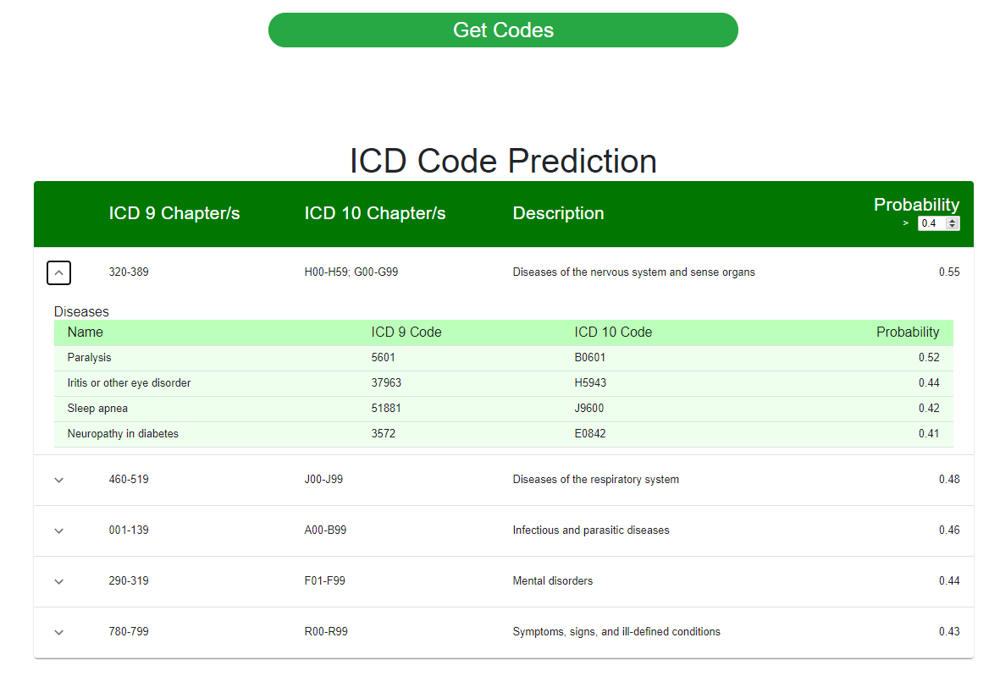

# MIDS-W210-Medical_Insurance_Payment_Assistant

Medical Billing Virtual Assistant or MBVA is a machine learning package that helps map medical notes to medical billing codes. This package is developed by four graduate students from the School of Information at the University of California, Berkeley, for their capstone project. MBVA uses a pretrained model, which is mainly based on Natural Language Processing (NLP) and MIMIC-III dataset, to analyze and examine medical notes.

# Quick Start

Navigate to containers sub-folder
```
docker-compose up -d
```

# UI


# Example Results


