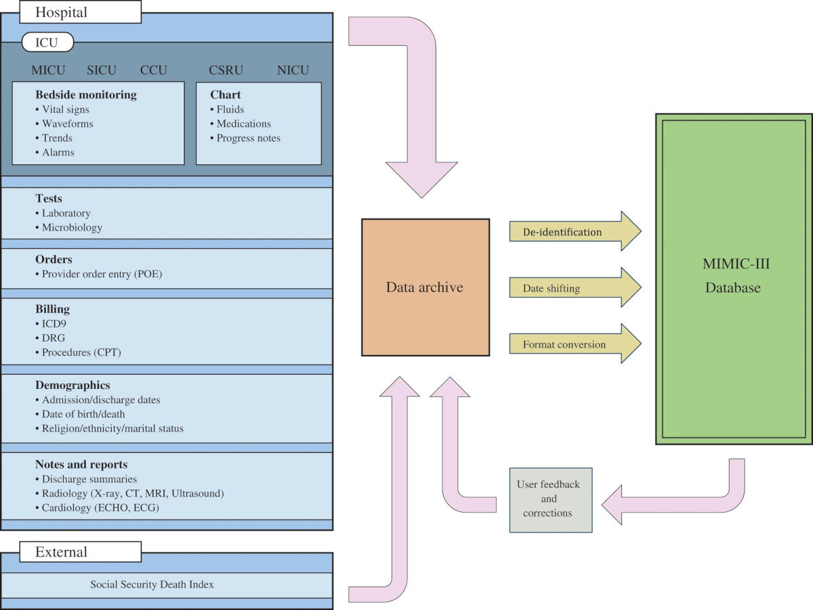

# Project Overview

### Dataset

The medical billing virtual assistant makes use of MIMIC-III dataset (1-4).  The description from physionet.org: "MIMIC-III is a large, freely-available database comprising deidentified health-related data associated with over forty thousand patients who stayed in critical care units of the Beth Israel Deaconess Medical Center between 2001 and 2012."

The data is a series of related tables that have anonymized patient data.  Using these tables, ICD-9 codes can be related to clinical note text.  The methodology for the creation of hte database is shown in the figure below (5).

The dataset can be found at the following location
https://physionet.org/content/mimiciii/1.4/

### References

1. Charles, D., King, J., Patel, V. & Furukawa, M. Adoption of Electronic Health record Systems among U.S. Non-federal Acute Care Hospitals. ONC Data Brief No. 9, 1–9 (2013).
2. Collins, F. S. & Tabak, L. A. NIH plans to enhance reproducibility. Nature 505, 612–613 (2014).
3. Johnson, A., Pollard, T., & Mark, R. (2016). MIMIC-III Clinical Database (version 1.4). PhysioNet. https://doi.org/10.13026/C2XW26.
4. Goldberger, A., Amaral, L., Glass, L., Hausdorff, J., Ivanov, P. C., Mark, R., ... & Stanley, H. E. (2000). PhysioBank, PhysioToolkit, and PhysioNet: Components of a new research resource for complex physiologic signals. Circulation [Online]. 101 (23), pp. e215–e220.
5. MIMIC-III, a freely accessible critical care database. https://www.nature.com/articles/sdata201635
